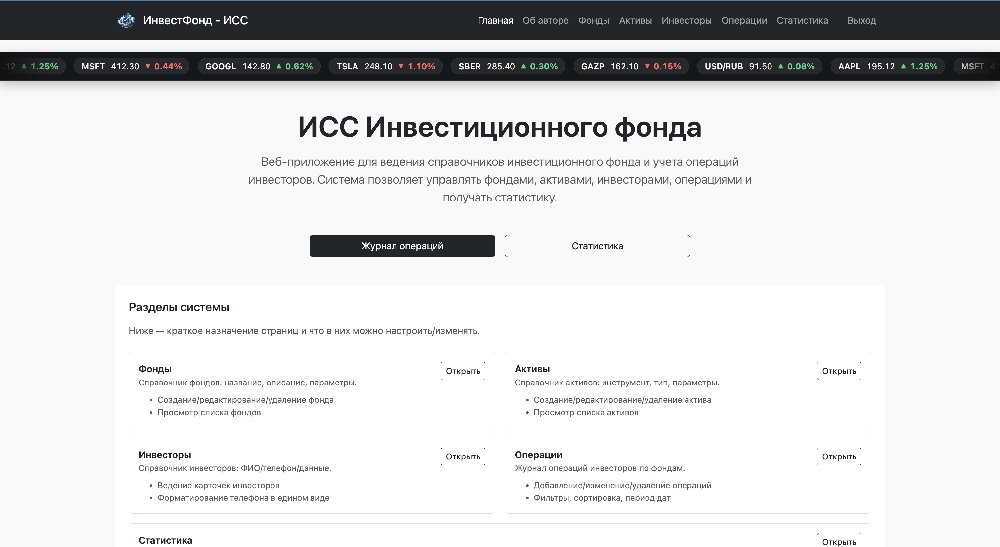
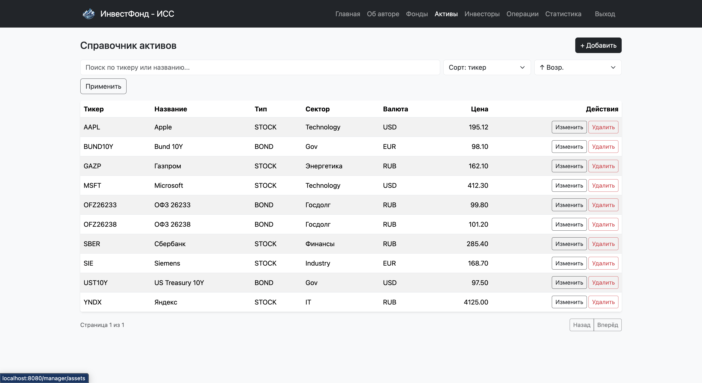
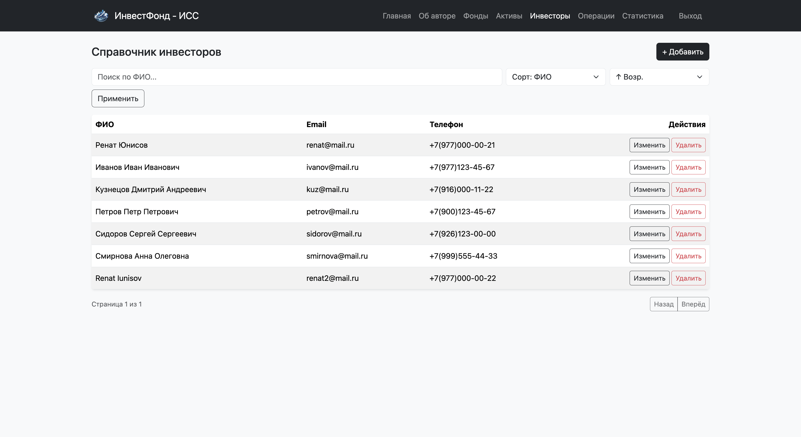

# ИнвестФонд — ИСС (Investment Fund ISS)



Веб-приложение (информационно-справочная система) для ведения справочников инвестиционного фонда и учета операций инвесторов.
Реализованы CRUD-страницы для фондов, активов, инвесторов и операций, а также раздел статистики.

## Возможности
- Авторизация и разграничение доступа по ролям (ADMIN / MANAGER)
- Фонды (CRUD + поиск/сортировка)
- Активы (CRUD + поиск/сортировка)
- Инвесторы (CRUD + поиск/сортировка)
- Операции (CRUD + фильтры по типу/фонду/инвестору/датам + сортировка)
- Статистика (кол-во операций, сумма net, топ фондов/инвесторов и т.д.)
- Страница «Об авторе»

## Технологии
- Java
- Spring Boot
- Spring Security (авторизация и роли)
- Spring Data JPA / Hibernate
- PostgreSQL
- Thymeleaf + Bootstrap (UI)

## Роли и доступ
- **ADMIN**: полный доступ
- **MANAGER**: рабочие разделы (фонды/активы/инвесторы/операции/статистика)

## Быстрый запуск (локально)
1. Установить зависимости (если нужно):
   - Java (подходящая версия)
   - PostgreSQL
   - Maven

2. Настроить БД в `src/main/resources/application.properties`:
   - `spring.datasource.url=jdbc:postgresql://localhost:5432/investment_fund_db`
   - `spring.datasource.username=...`
   - `spring.datasource.password=...`

3. Запуск:
```bash
mvn clean package
mvn spring-boot:run
```

4. Ссылка:
http://localhost:8080/login/


## Демонстрация страниц: 






## Структура проекта (файлы):

```
investment-fund-iss/
├── src/
│   ├── main/
│   │   ├── java/
│   │   │   └── com/coursework/investment_fund/
│   │   │       ├── InvestmentFundApplication.java   # Точка входа Spring Boot
│   │   │
│   │   │       ├── security/                         # Безопасность и роли
│   │   │       │   ├── SecurityConfig.java
│   │   │       │   └── UserDetailsServiceImpl.java
│   │   │
│   │   │       ├── fund/                             # Фонды
│   │   │       │   ├── Fund.java
│   │   │       │   ├── FundRepository.java
│   │   │       │   └── FundController.java
│   │   │
│   │   │       ├── asset/                            # Активы
│   │   │       │   ├── Asset.java
│   │   │       │   ├── AssetRepository.java
│   │   │       │   └── AssetController.java
│   │   │
│   │   │       ├── investor/                         # Инвесторы
│   │   │       │   ├── Investor.java
│   │   │       │   ├── InvestorRepository.java
│   │   │       │   └── InvestorController.java
│   │   │
│   │   │       ├── tx/                               # Операции
│   │   │       │   ├── InvestmentTransaction.java
│   │   │       │   ├── TransactionRepository.java
│   │   │       │   └── TransactionController.java
│   │   │
│   │   │       └── stats/                            # Статистика
│   │   │           ├── StatsController.java
│   │   │           └── NameAmountRow.java
│   │   │
│   │   ├── resources/
│   │   │   ├── templates/                            # HTML-шаблоны Thymeleaf
│   │   │   │   ├── fragments/                        # Общие фрагменты
│   │   │   │   │   └── layout.html
│   │   │   │   ├── funds/
│   │   │   │   ├── assets/
│   │   │   │   ├── investors/
│   │   │   │   ├── tx/
│   │   │   │   ├── stats/
│   │   │   │   ├── about.html
│   │   │   │   └── index.html
│   │   │   │
│   │   │   ├── static/                               # Статические ресурсы
│   │   │   │   └── img/                              # Логотип и изображения
│   │   │   │       ├── logo.png
│   │   │   │       └── author.jpg
│   │   │   │
│   │   │   ├── application.properties                # Конфигурация приложения
│   │   │   └── data.sql                               # Демонстрационные данные
│   │
│   └── test/                                         # Тесты (при необходимости)
│
├── mvnw                                              # Maven Wrapper (Unix)
├── mvnw.cmd                                          # Maven Wrapper (Windows)
├── pom.xml                                           # Maven-конфигурация проекта
└── README.md                                         # Описание проекта
```